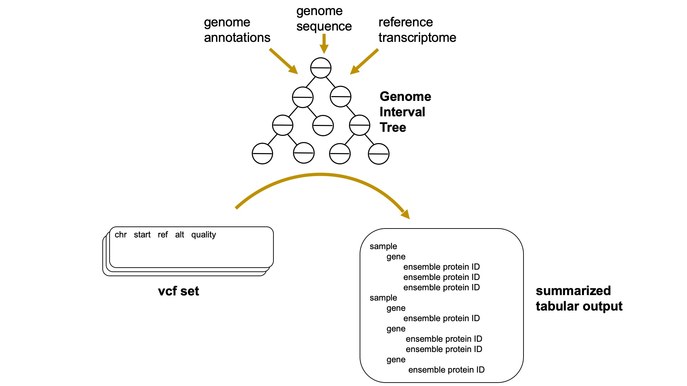

## Motivation

A single "typo" in the genome can have massive consequences in the resulting organismal biology, and identifying the functional consequences of DNA mutations, or variants, is a fundamental problem in bioinformatics. 
While tools to identify the variants already exist, and there are tools to interpret the results of *individual* samples, *cerebra* fills the gap of wrangling the variant calling files across thousands of samples, and summarizing the functional outcomes of the genomic "typos."

To find variants in the genome, researchers often begin with a [DNA-sequencing](https://en.wikipedia.org/wiki/DNA_sequencing) (DNA-seq) or [RNA-sequencing](https://en.wikipedia.org/wiki/RNA-Seq) (RNA-seq) experiment on their samples of interest.
After sequencing, the next step is alignment to the reference genome with tools like [STAR](https://github.com/alexdobin/STAR) or [BWA](http://bio-bwa.sourceforge.net/), followed by variant calling with tools like [GATK HaplotypeCaller](https://software.broadinstitute.org/gatk/documentation/tooldocs/3.8-0/org_broadinstitute_gatk_tools_walkers_haplotypecaller_HaplotypeCaller.php) 
or [freebayes](https://github.com/ekg/freebayes). 
Variant callers produce tab delimited text files in the ([variant calling format](https://samtools.github.io/hts-specs/VCFv4.2.pdf), *.vcf*)
for each processed sample, which encode the genomic position, reference vs. observed DNA sequence, and quality
associated with each observed variant. [OBB: Add a `head` output of an example vcf file]

Current methods for variant calling are incredibly powerful and robust, however, a single sequencing run can generate on the order of 10^8 unique vcf entries, only a small portion of which are of relevance to the researcher. 
In addition, variant callers report only the variant itself, and not the functional consequences of each mutation, *i.e.* the effect the mutation has on the translated protein sequence, termed "peptide-level variants." 
We introduce *cerebra*, a python package that provides fast and accurate peptide-level summarizing of vcf files.

## Functionality

`cerebra` comprises three modules: (1) `germline-filter` removes variants that are common between germline samples 
and samples of interest, (2) `count-mutations` reports total number of variants in each sample, and (3) `find-aa-mutations` reports likely peptide-level variants in each sample. 
While `cerebra` focuses on *variants* defined specifically as single nucleotide polymorphisms (SNPs) and short insertions and deletions, other genomic variations exists, suc as larger structural variants such as copy number variations and chromosomal rearrangements. 

A cruical data structure in `cerebra` is the *genome interval tree*, a data structure that matches RNA transcripts
and peptides to each feature in the genome (*Figure 1*). 
Interval trees are self-balancing binary search trees that store numeric intervals and can quickly find every such interval that overlaps a given query interval. 
They have theoretical average-case O(log*n*) and worst-case O(*n*) time complexity for search operations, making them tractable for genome-scale operations. [todo: do i need a source for this? OBB: Yes] 
Tree construction proceeds at O(*n*log*n*) time complexity, making construction rather than search the bottleneck for small vcf sets. [todo: say something about memory footprint]
The genome interval tree is constructed with a reference genome sequence ([FASTA format](https://en.wikipedia.org/wiki/FASTA_format), often with a `.fa` extension), a genome annotation 
([gene transfer format, GTF](https://www.gencodegenes.org/pages/data_format.html)`.gtf` extension) and a reference transcriptome (OBB: also `.fa` format? Why is this necessary? Can't the transcriptome fasta be extracted from the gtf + fasta? see: https://github.com/nf-core/rnaseq/blob/3b6df9bd104927298fcdf69e97cca7ff1f80527c/main.nf#L802). 

[OBB: will this have a figure caption?]

### `germline-filter`

If the research question is centered around a "tumor vs control" question, then **germline-filter** is the proper starting point. 
This module removes germline variants that are common between the control and the experimental tissue so as to not bias the results by including non disease causing variants. 
The user provides a metadata file that indicates which experimental samples correspond to which control samples. 
We initiate a [thread pool OBB: Define this] then use the [vcfpy](https://pypi.org/project/vcfpy/) library to quickly identify shared variants across control/experimental matched vcf files, then write new ones that contain only unique variants. 
There is also the option to limit the reported variants to those found in NCBI's [dbSNP](https://www.ncbi.nlm.nih.gov/books/NBK21088/) and the Wellcome Sanger Institute's [COSMIC](https://cancer.sanger.ac.uk/cosmic) databases. 
This option is designed to give the user a higher
degree of confidence in the pathogenic nature of each variant -- if independent experiments have reported a given variant, there is a higher likilihood that it is pathogenic. 
The output of **germline-filter** is a set of trimmed-down vcf files. 

[OBB: Suggest to partition based on use cases, e.g.:

1. Starting data is tumor-vs-control
2. I have a lot of vcfs

Then show example commands/workflows for these questions.]

### `count-mutations`

The subcommand `cerebra count-mutations` builds a genome interval tree from the reference gtf, reads in a vcf file and converts it to a [vcfpy](https://pypi.org/project/vcfpy/) object and then processes vcf entries in parallel. 
Each variant is matched to its corresponding gene and gene-wise counts are stored in shared memory. 
We then report the raw number of variants found in each sample. 
The output is a `.csv` file that contains counts for each sample versus every gene in the genome. 

### `find-aa-mutations`

The subcommand `cerebra find-aa-mutations` identifies the consequence of the mutation in the resulting translated protein. 
To find the mutational consequences, `cerebra find-aa-mutations` loads the reference gtf, indexes the genome fasta file with [pyfaidx](https://pypi.org/project/pyfaidx/) for memory efficient access and then constructes a genome interval tree 
that can quickly match genomic coordinates from vcf entries to peptide-level mutations. 
In addition, if working  with cancer samples, the user has the option to filter out all mutations that are not found in the [COSMIC](https://cancer.sanger.ac.uk/cosmic) database and are therefore unlikely to be pathogenic. 
The `.vcf` files are split chunk-wise and queried against the genome interval tree in parallel. 
Results are stored in a shared memory object. 
We then convert variant hits to [ENSEMBL](https://uswest.ensembl.org/index.html) protein IDs, 
in acordance to the [HGVS](https://varnomen.hgvs.org/) sequence variant nomenclature. 
The output is a heirarchically ordered text file (csv or json) that reports the the Ensemble protein ID and the gene associated with each variant, for each experimental sample. 

We should stress that **find-aa-mutations** does not *definitively* report peptide-level variants but rather the *likely*
set of peptide variants. Definitively reporting protein variants requires knowledge of alternate splicing -- this represents
an open problem in scRNA-seq. [todo: would be nice to have a source for this OBB: check the references in the introduction of this paper: https://www.biorxiv.org/content/10.1101/2020.04.14.041905v1.full.pdf] 
For example, if a read picks up a mutation in exon 2 of geneA, we can report each of the potential spliceforms of geneA that contain exon 2, but we **cannot** infer which of those particular spliceforms are actually present in our sample. 
Thus we report all possible spliceforms; determining the spliceform landscape of an individual cell from scRNA-seq is outside the scope of this project. 

We tested *cerebra* on a set of high-quality reference-grade vcf files from the [Genome in a Bottle consortium](https://www.nist.gov/programs-projects/genome-bottle). 
Each of the seven vcf files was quite large, (~2GB) and *cerebra* was run on standard hardware (Mac laptop, 2.5GHz quad-core processor, 16 GB RAM). *cerebra* processed the seven files in 44 minutes, see *Figure 2*. 
The Genome in a Bottle vcfs are quite large and are perhaps not comparable to those generated in a typical sequencing experiment. Thus we next assessed performance on an independent set of vcf files. 
This vcf set comes from a single-cell 
RNA-seq experiment conducted on lung adenocarcinoma patient samples. 
Alignment was done with STAR and variant calling was performed with GATK HaplotypeCaller. 
The carcinoma vcfs are much smaller, on the order of megabytes rather than gigabytes. The results are shown in *Figure 2* -- *cerebra* clocks in at 34 minutes for the set of 100 vcfs.

[todo: add Figure 2]

One interesting observation is that the first ~10 minutes of the *cerebra* timecourse appear flat, that is, no vcfs are processed [OBB: Is it possible to provide pre-built indices that take <1m to load?]. 
This can be attributed to the genome interval tree construction phase. 
After the tree is built, files are 
processed in a near-linear manner. 
Also of note is that *cerebra*'s search operations take advantage of multiprocessing.
Thus *cerebra* should scale better to high-memory machines with more cores, though it has been designed to run on everyday hardware. 

[todo: what else can i add for validation?]

## Conclusions

Our tool satisfies an unmet need in the bioinformatics community. 
Fast and accurate peptide-level summarizing of variants in a sequencing experiment is often crucial to understanding the underlying biology of an experimental system. 
As sequencing costs continue to drop, large-scale variant calling will become more accessible to all members of the community, and summary tools like *cerebra* will become more important. 
*cerebra* is fast and accurate and is one of the only tools that fills this niche. 
It offers the advantage of a single, easy-to-interpret output file, making downstream analysis accessible to non-bioinformatically inclined members of the community.

## Acknowledgments

Funding for this work was provided by the [Chan Zuckerberg Biohub](https://www.czbiohub.org/). The authors would like
to thank Ashley Maynard, Angela Pisco and Daniel Le for helpful discussions and support.

## Correspondence

Please contact `lincoln.harris@czbiohub.org`

## Code

*cerebra* is written in python. Code and detailed installation instructions can be found at https://github.com/czbiohub/cerebra. In addition *cerebra* can be found on [PyPi](https://pypi.org/project/cerebra/).

## References

[todo: add?]

